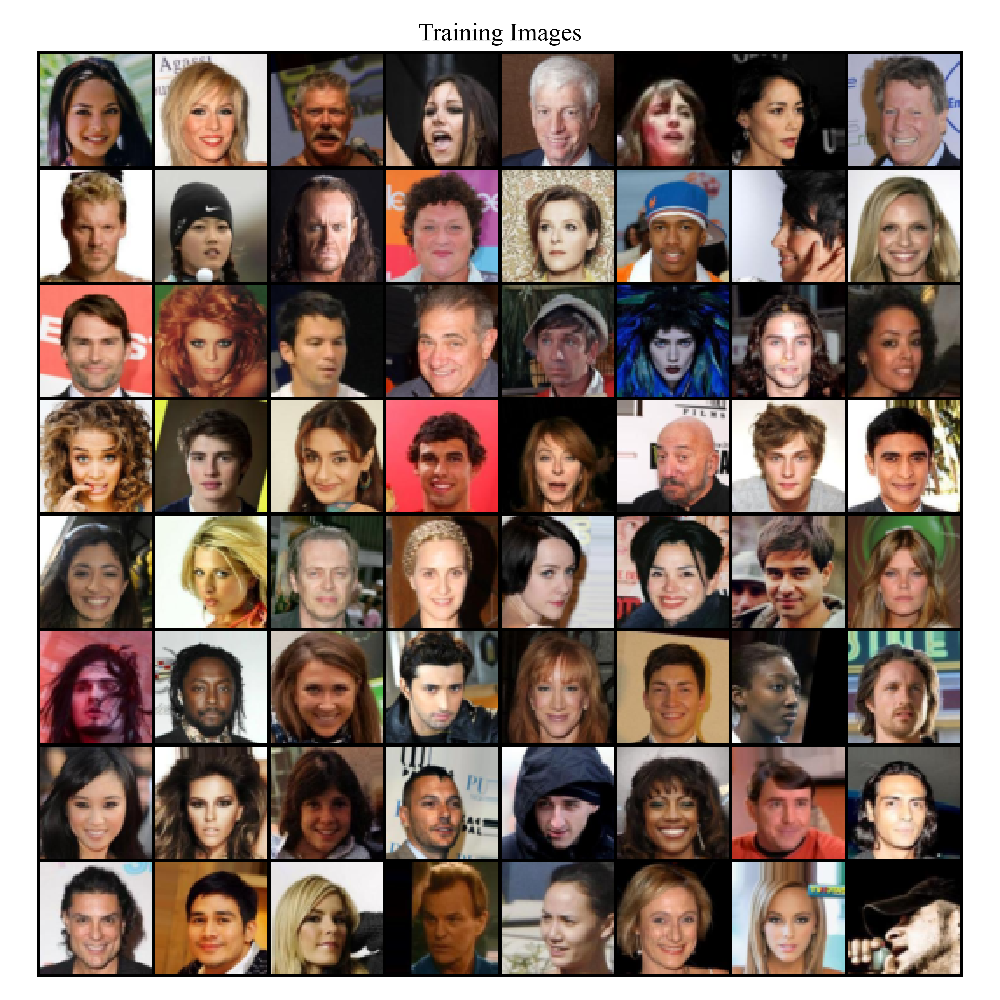
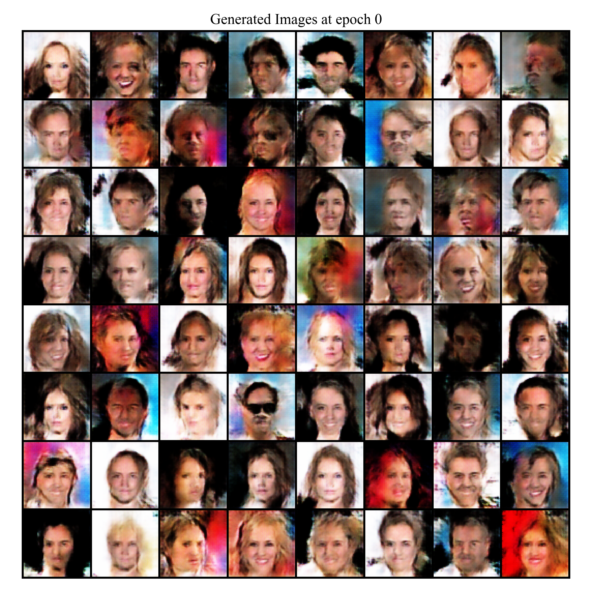
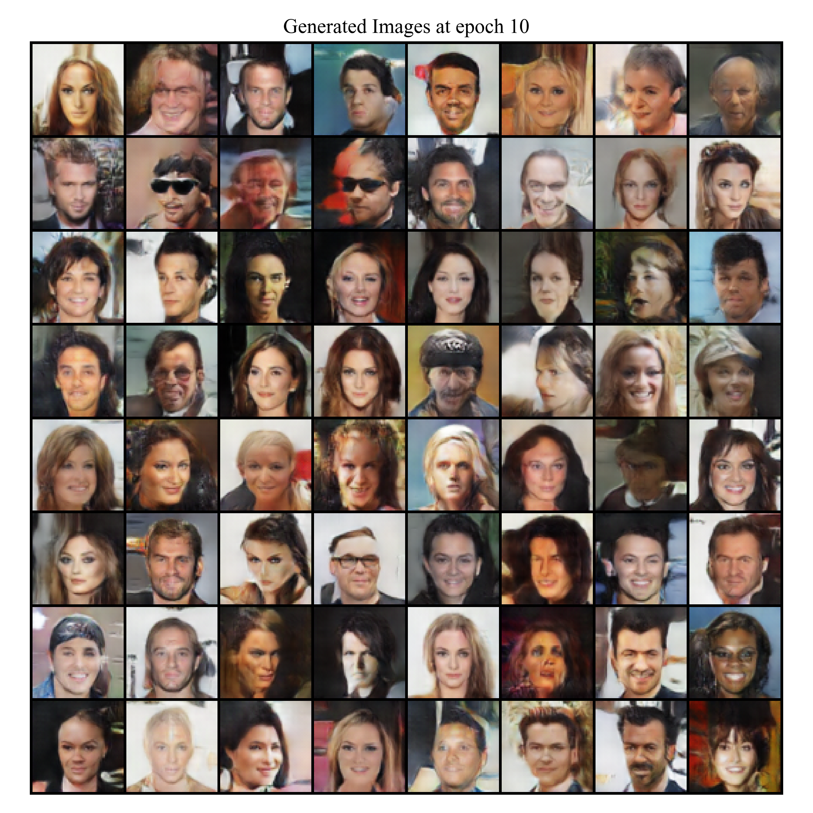
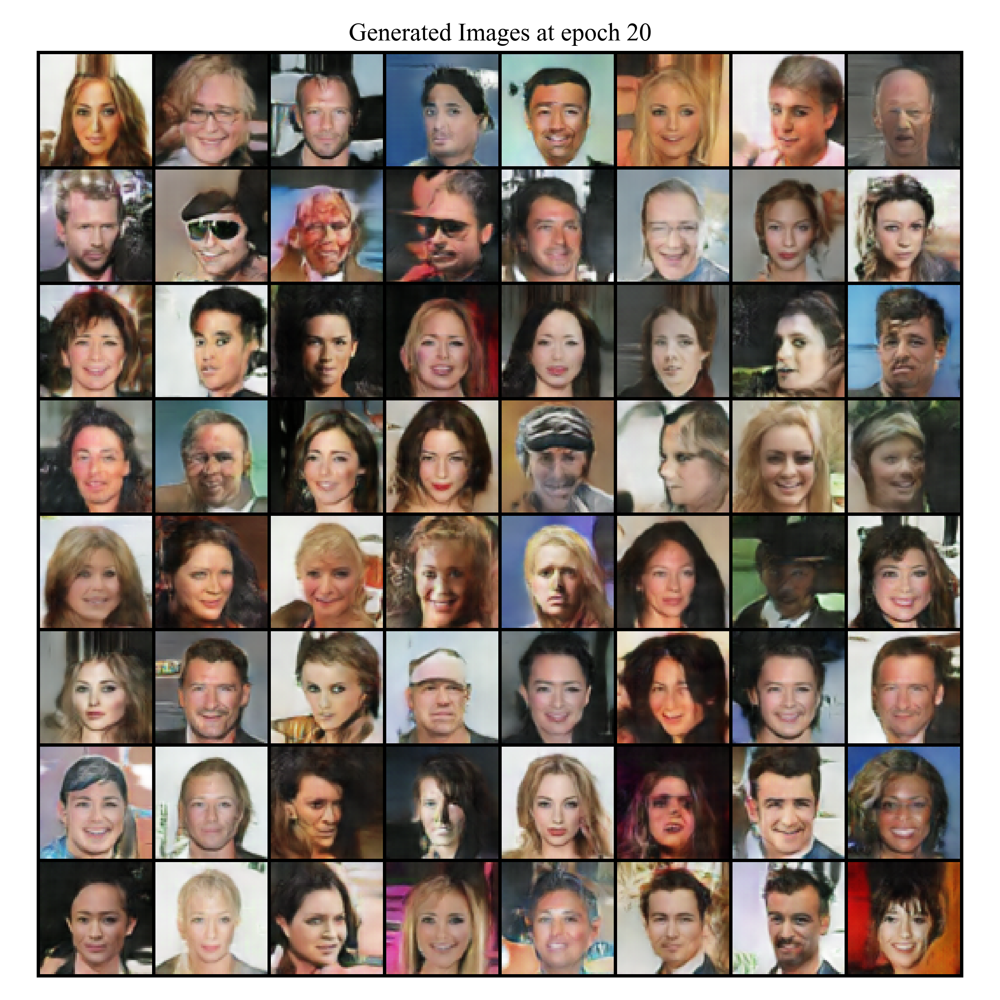

# DCGAN - Deep Convolutional Generative Adversarial Network

DCGAN tutorial [here](https://pytorch.org/tutorials/beginner/dcgan_faces_tutorial.html). 

## Results
| Real images | Fake images (epoch 0) | Fake images (epoch 10) | Fake images (epoch 20) |
| :---: | :---: | :---: | :---: |
|  |  |  |  |

## Structure
* `main.py` - Main file to run training of generator and discriminator, and generate fake images. 
* `models.py` - Utility. Model implementation (generator and discriminator). 
* `train_utils.py` - Utility. Functions to train models. 
* `tutorial.py` - Raw copy of the tutorial in [PyTorch documentation](https://pytorch.org/tutorials/beginner/dcgan_faces_tutorial.html). 

## Usage
```
python main.py [-b BATCH_SIZE] [-e EPOCHS] [-p PATIENCE] [-r LR] [-d DEVICE] [-s SEED] [--fraction FRACTION]
```
* `device`: `"cpu"` / `"cuda"` / `"mps"`
* `fraction`: How much of the data (Celeb-A) used to train. Change this to small values (e.g., `0.05` or `0.2`) for a quick code check. 

